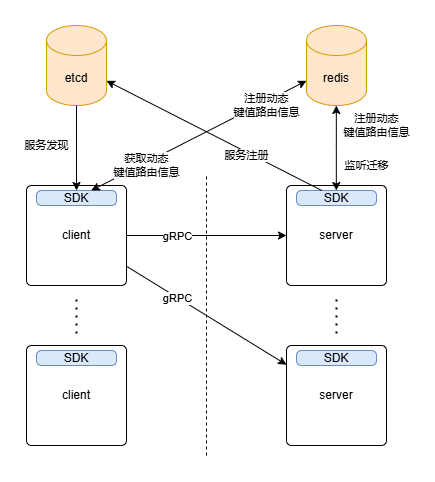

# YAPR(Yet Another Poor Router)设计文档（潦草版）

## 概念

在本项目中，概念的定义如下：

- Router被定义为一组路由规则的集合，客户端可直接访问路由名
- Rule被定义为在请求符合任一Match的条件时使用某个Selector进行选择的规则
- Selector被定义为为某个Service的所有Endpoint按照策略进行选择的工具
- Service被定义为一组Endpoint的集合，包含了所有服务端为该服务提供的Endpoint
- Endpoint被定义为一个IP地址
- URI被定义为访问的方法名

## 架构



如图，本项目使用的方案是在客户端进行路由。client在调用SDK初始化后会从数据库中获取路由信息，并在路由状态更新时及时从数据库同步。这些路由信息会实例化为Router/Selector/Service三种对象，通过自定义Resolver/Balancer/Picker让gRPC能使用Router实例来创建subConns并选择正确的连接路由到对应的Server。

## 控制平面与配置

用数据库集群代替控制面，在不影响业务需求的前提下简化系统设计

数据库在未初始化时会由随机一个抢到锁的SDK通过配置文件初始化，需要初始化的数据包括：

- 数据库配置（etcd/redis）
- Router配置
- Selector配置

参见[yapr.yaml](../deploy/yapr.yaml)

路由配置的保证正确的版本保存在etcd，每次更新配置都会通知所有服务

而动态键值路由信息最初是实时从redis获取，后在此基础上添加一个LRU的cache，缓存不一致问题见下文

## 服务注册

服务需要调用SDK来添加支持的服务，向Router添加Service到Endpoint的多重映射关系。每个服务器都会随机一个uuid，与该服务有关的Endpoint都会聚合在该uuid下，方便管理

这里使用了etcd的KeepAlive来进行保活，确保在服务端挂掉时能及时更新数据库中相关的服务状态

## 服务发现

直接通过gRPC来发出服务请求，目标填写yapr:///RouterName(:Port)即可

在自定义的Resolver中会尝试在本地获取Router，若没有则从数据库拉取相应数据（包括Router和他用到的Selectors和Services），同时对可能发生变化的字段进行Watch（Service下的Endpoint和他对应的属性）

## 路由策略

大致过程如下：

- 通过RouterName找到对应Router（没有就从数据库拉）
- 从Router中遍历Rules，找到第一个匹配的Rule
- 通过Rule中的SelectorName找到对应Selector
- 通过Selector中记录的ServiceName找到对应Service
- 在Service中查询获取所有可选Endpoint和他在该Selector中的属性
- 按照Selector的策略选择一个Endpoint转发

### （加权）随机

（根据权重）随机一个Endpoint路由

### （加权）轮询

（根据权重）轮流路由，在Service发生更新后Endpoint数组会被重新生成

### 最小代价

服务端需要上报每个Endpoint的cost（被存储为weight，weight=MAX_INT-cost），选择一个cost最小的Endpoint进行路由

### 一致性哈希

需要在Selector中指定header key，然后根据header value进行一致性哈希

在发生拓容或缩容时，触发拓容的服务端会通知所有有关服务端发生迁移。值得注意的是，一旦使用了跳跃一致性哈希，那么只有最后一个Endpoint允许缩容

### 指定目标与动态键值

指定目标需要的参数有：

- SelectorName, HeaderValue
- Endpoint, Timeout
- IgnoreExisting

例如想设置玩家A对Zone服务的访问只能发送到目标B，那么参数的设置方法为：SelectorName=某个在Service `zone`上进行选择的选择器名
，HeaderKey=Selector.Key（这个Key自然是"player-id"），HeaderValue=`$A.id`，Endpoint=`$B`
，Timeout自由设置，IgnoreExisting为true以保证一致性

IgnoreExisting为false并成功覆盖原有键值路由时，会通知原本的Endpoint所在的服务端发生迁移

为了提供更好的性能，这里使用了一个LRU缓存来存储最近的请求，以减少对数据库的访问。一旦出现缓存不一致，当次请求发送到错误的服务端后，服务端会拒绝请求并返回错误码，客户端会更新缓存并重新请求，最多重试3次

## 异常处理

可以通过修改配置文件来设置异常处理的策略，例如：

```yaml
error_handler:
  no_endpoint: "pass"
  bad_endpoint: "block"
```

这里指定了当没有可用或者指定的Endpoint时，跳过当前规则转而尝试后续规则；而当选定的Endpoint已经掉线时，阻塞这个请求（直到超时或者Endpoint恢复）